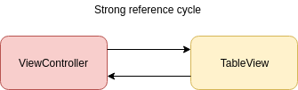
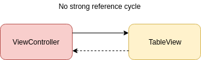

# Swift  - Notes

Type-safe opensource language mainly used for the closed  Apple-Environment. Based on C and Objectiv-C. 

- [Basics](#Basics)
    - [Datatypes](#Datatypes)
    - [TypeAliases](#TypeAliases)
    - [Optionals](#Optionals)
    - [Operators](#Operators)
- [Functions](#Functions)
    - [Closures](#Closures)
- [Structures, Enums and Classes](#Structures,-Enums-and-Classes)
- [Protocols](#Protocols)
- [Views, Controls and Gestures](#Views,-Controls-and-Gestures)
- [Strong reference cycle](#Strong-reference-cycle)


## Basics

### Datatypes

#### Float, Double, Int, String, Bool, Any

```swift
var pi: Float = 3.14
let name: String = "Jack"
var check: Bool = true
let age: Int = 34
var some: Any = "Whatever" // can hold any kind of data
some = true
some = 33

// Unicode characters for naming:
let π = 3.14159
let 你好 = "你好世界"
let 🐶 = "dog"
```

Type-inference and type-safety. Swift performs type-checks when compiling. Type-specification is done by Swift

```swift
let price = 4.50 // <i>price</i> is inferred to be of type Float
```

#### Tuples

```swift
let Person = ("Hans", 33) // Type of (String,Int)
```


### TypeAliases

Type aliases define an alternative name for an existing type. Useful for refering to a name that is contextually more appropirate. Usable for most any type: classed, enums, tuples, closures, etc.

```swift
typealias JWT = String
typealias Employees = Array<Employee>
typealias GridPoint = (Int, Int)
typealias CompletionHandler = (ErrorType?) -> Void
```

### Optionals 

Optionals are useful in a situation where a value might be null. 

```swift
var someName: String? // default value is set to nil
let anotherName = String(someName) // inferred to optional String
```

#### Forced Unwrapping

With the exclamation mark optionals are forced unwrapped.
> Trying to use ! to access a nonexistent optional value triggers a runtime error. Always make sure that an optional contains a non-nil value before using ! to force-unwrap its value.

```swift
var name = "Meyer"
var firstName = "Hans"
var secondName: String? = nil

print( \(name): \(secondName!): \(firstName)  // Fatal error: Unexpectedly found nil while unwrapping an Optional value
```

#### Optional Binding

<i>Optional Binding</i> can be used in `if` and `while` statements. 

```swift
if let actualName = String(someName) {
    print("String value of \(actualName)")
}
```

The new constant `actualName` contains the value of the optional. No need to use <i>force unwrapping</i> to access the value. Multiple optional bindings seperated by commavcan be used in a single if-statement. 

```swift
if let actualName = String(someName), var actualSurname = String(someSurname), actualName != actualSurname {
    print("String value of \(actualName)")
}
```

### Operators

See [Operator Declarations](https://developer.apple.com/documentation/swift/swift_standard_library/operator_declarations)

#### Nil-Coalescing Operator

```swift
var result = (inputValue != nil ? inputValue! : defaultValue) // common ternary conditional operator
var result = inputValue ?? defaultValue // nil-coalescing operator (shorthand for code before)
```

#### Range Operator

```swift
let lads = ["jack", "john", "jim", "jerk"]
for i in 0...5 {} // closed range > runs 0 to 5
for lad in 0..<lads.count {} // half-open range > runs 0 to 3
for lad in lads[2...] {} // one-sided range >  runs 2 to 3
for lad in lads[..<2] {} // half open one-sided range >  runs 0 to 1
for i in 2... {} // infinity
```

## Collections

Array, Set, Dictionary
```swift
var someValues = [String]()
var distinctValues : Set<String> = ["a", "b", "c"]
var keyValue = [Int : String]() // like a map
```


## Functions

Functions are immutable Types like in Javascript.

### Return Values

Return Values can be single, multiple or optional.

```swift
func giveName() -> String {} // single
func giveMultiValues() -> (String, String, Int) {} // multiple

let (name, first, age) = giveMultiValues()

func giveOptionalTuple() -> (Int, String)? {} // optional multiple
if let tup = giveOptionalTuple() {
    print("woahh!")
}
```

### Params

All params must have unique names. They even can be specified by labeling or omited.
```swift
func manyParams(first: String, second: Double, third: Bool) {} // multiple
manyParams(first: "First", second: 123.45, third: false)

func labelParams(person: String, from city: String) {} // labeled
labelParams(person: "Jack", from: "Ireland")

func omitParams(_ name: String, _ age: Int) {} // omitting with _
omitParams("Jill", 20)

func defaultParams(name: String = "unknown") {} // default value

func variadicParams(_ nums: Int...) {} // list of Int's
variadicParams( 2, 2, 4, 1, 23, 334)

```

### In-Out Params

Function params are constants by default. If it's necessary to to change the value of a param, in-out params are required.
```swift
func changeSomeValue(_ a: inout Int) {} // inout keyword
changeSomeValue(&a) // (&) ampersand vefore the variable
```


### Function Types

Variable or Constant with a assigned function.

```swift
var someFunction = anotherFunction
let addTwoInts: (Int, Int) -> Int
let anotherFunc : (Int, Int) -> Int = addTwoInts
```

### Closures

Closures are blocks of functionality that can be passed around in code. Similar concepts in other languages are lambdas.

General syntax form of a closure expression:

```swift
{ ( params ) -> return type in 
    statements
}

let numbers = [ 1, 2, 3 ]
numbers.map({ (value : Int) -> (Int) in
    return value * 3
})
```
Syntax can get much shorter for Swift-blocks
```swift
numbers.map({(value : Int) -> Int in value * 3}) // no return statement in one-liner necessary
numbers.map({(value) in value * 3}) // param and return typ gets resolved by compiler
numbers.map({$0 * 3}) // params can be used without explizit declaration
numbers.map{$0 * 3} // no brackets needed, if the last param of a function is a block
```

#### Asynchronous Closures 

If a closure is passed to a function, but called after the function returns, the closure needs to escape. Therefore write `@escaping` before the param's type. 

Swift keeps the Callback-Function in memory, otherwise you get a compile-time error.  


## Structures, Enums and Classes

Both types are pretty similar. Main difference between Classes and Structures is: 

> Structures and Enums are ValueTypes -> Values are copied <br> 
> Classes are ReferenceTypes -> Reference to existing instance is used


```swift
var s1 = Struct()
var s2 = s1 // -> new object by copy
var c1 = Class()
var c2 = c1 // -> reference points on same instance like c1
s1.increase()
c1.increase()
assert(s1.value != s2.value) // -> true
assert(c1.value == c2.value) // -> true
```

Both types define `properties`, `methods`, `supscripts`(getter/setter) and `initializers`(constructors).

Classes additionaly can use `inheritance`.
Structs are better optimized by the compiler!


## Protocols

Definition of an interface, while the class, struct or enum holds the implementation.

```swift
protocol CanSwim {
    swim()
}

class Ship: CanSwim {
    swim() {
        print("swimming...")
    }
}
```

### Extensions

Extensions add new functionality to existing types. 

```swift
extension CanSwim {
    func swim("Default-swim-style")
}

extension Int { // extension to the Int type
    func addSelf() {
        self = self + self
    }
}
var someInt = 5
someInt.addSelf() // results in 10
```

## Views, Controls and Gestures

Everything you see is a view.

### Controls 

All UIControl-subclasses respond to the same <b>action-target</b> pattern.
Always when the control gets an interaction, the action will be executed.


### Gestures 

Gestures respond aswell to the <b>action-target</b> pattern.

Two groups of recognizer classes:

- discret ( possible -> recognized )
    - tap 
    - swipe
    - screenedge
- continuous ( possible -> began -> changed -> ended )
    - longPress
    - pan
    - rotation
    - pinch

### Delegates

Tables and collections don't have to care about specific implementations, they delegate it to another object. For Example: A view isn't responsible for handling user interaction. It delegates this responsibility to a delegate object which conforms to the `UITableViewDelegate` protocol.


- UITableViewDataSource: What data and how many
- UITableViewDelegate: Cell-Interaction


### ViewControllers / Storyboards

UIViewController = StateMachine

loadView() muss immer die View assignen!! 
```swift
self.view = someView
```

### NavigationController

- Has a `stack` of ViewControllers (pushViewController - popViewController)
- ViewController has a reference to the NavigationController


### Multithreading

Use <b>MainThread()</b> only for ViewTasks. Everything else should be run in BackGroundThreads. (performance reason)

<b>RunLoop</b>
EventQueue 

URLSessions execute their callback function in a background queue. For this use DispatchQueue.main.async() to update the user interface...


## Strong reference cycle

References are strong by default. 

```swift
class UITableView {
   var dataSource: UITableViewDataSource
   var delegate: UITableViewDelegate
}
```

The TableView and the ViewController keep each other alive. Even if they are no longer needed by the app, they aren't deallocated. (Memory leak)



Better to declare properties as weak or unowned reference, to break strong reference cycle.

```swift
class UITableView {
    weak var dataSource: UITableViewDataSource?
    weak var delegate: UITableViewDelegate?
}
```



### Difference between weak and unowned

`unowned`: 
 - reference is always expected to have a value
 - direct access to value

`weak`:
- reference is set to `nil`, if instance they reference is deallocated
- weak reference is always an `optional`
- value needs to be unwrapped

### Retain Cycle

<b>Closures with self-reference</b>

Closures are reference-types! Use CaptureList to get rid of the strong reference.
The capture list is positioned before the parameters of the closure or, if no parameters are defined, before the in keyword. A capture list is nothing more than a collection of pairs wrapped in square brackets.

- the type of reference (weak or unowned) on the left
- and the reference it applies to on the right

```swift
class Device {

    let model: String
    let manufacturer: String

    lazy var summary: () -> String = { [unowned self] in
        return "\(self.model) (\(self.manufacturer))"
    }
}```